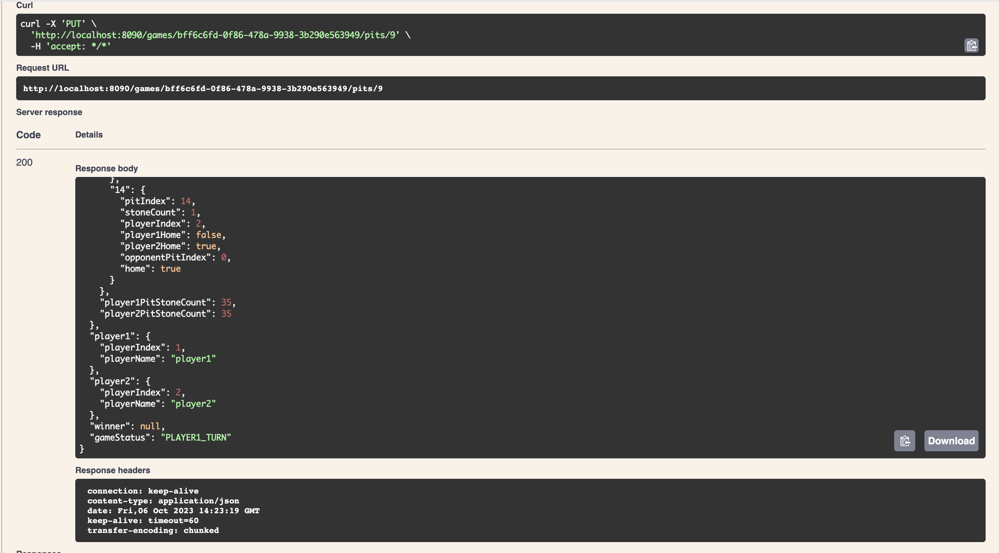

# kalahgame

This is a Kalah game application implemented in Java and Springboot.The implementation of this app would be 6 stones in 6 pits for each player except their kalah(home) by default. 

## Rules of the game

* Each of the two players has six pits in front of them.
* To the right of the six pits, each player has a larger pit, his Kalah or home.
* To start the game, six stones are put in each pit.
* The player who begins picks up all the stones in any of their own pits, and sows the stones on to the right, one in each of the following pits, including his own Kalah.
* No stones are put in the opponent's' Kalah. If the players last stone lands in his own Kalah, he gets another turn. This can be repeated any number of times before it's the other player's turn.
* Two players have to play on the same screen.The game is over as soon as one of the sides run out of stones. The player who still has stones in own pits keeps them and puts them in own Kalah.
* The Winner of the game is the player who has the most stones in his Kalah. 

### Prerequisites and Dependencies

* Java 17
* Maven 3.8.2
* Springboot 3.1.4
* open-api 2.0.2

### Execution

1. **Checkout the source code**
    ```
      git clone https://github.com/revathiieee/kalah-app
      cd kalah-app
    ```

2. **Build the application**
    ```
    mvn clean install
    ```

3. **Run the application**
    ```
    mvn spring-boot:run
    ```

### REST API Docuumentation

After running the application and browse the swagger api url

http://localhost:8090/swagger-ui/index.html

### Screenshots





Happy Coding!
